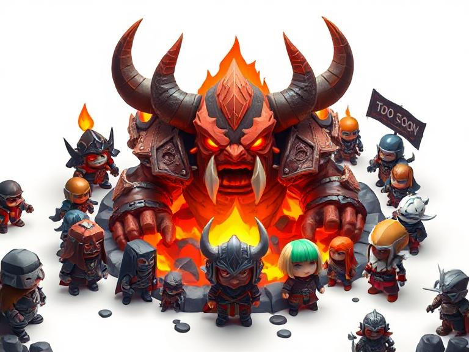

# 🎮 Welcome to WoW Emulation Community Discussions

Hey there, friend! 👋 Welcome to our cozy corner of the internet where we chat
about all things WoW emulation!

## 🌟 What We're All About

We're a community dedicated to preserving the magic of World of Warcraft versions
1.x through 5.x (all the MPQ-based versions). Think of us as digital archaeologists,
keeping these classic versions alive for future generations to study, enjoy, and
learn from. We're not here to compete with Blizzard's Classic WoW – we're here
because we love the technical challenge and the nostalgia!

Founded in August 2023, our community has grown into a warm, welcoming space where
everyone from complete beginners to seasoned developers can share their passion
for WoW emulation.

## 💬 What Are These Discussions For?

This is your space to:

- 🤔 **Ask Questions** - Seriously, no question is too small! Whether you're wondering
  how to set up your first server or diving into packet analysis, we're here to help
- 💡 **Share Ideas** - Got a cool feature idea? A new approach to an old problem?
  We'd love to hear it!
- 🎯 **Report Issues** - Found a bug? Let us know! Every report helps make our
  projects better
- 📚 **Learn Together** - Share tutorials, guides, or just chat about what you've
  learned
- 🎉 **Celebrate Wins** - Got your first server running? Fixed a nasty bug? We want
  to celebrate with you!
- 🤝 **Connect** - Meet other emulation enthusiasts and maybe find your next
  collaboration partner

## 🌈 Our Community Values

Before you dive in, here's what makes our community special:

- **🫂 Kindness First** - We're all here to learn and have fun. Be patient, be helpful,
  be awesome!
- **🎓 Beginner-Friendly** - Remember, everyone was new once. We celebrate questions
  and curiosity
- **🔧 Open Source Spirit** - We believe in sharing knowledge and helping each
  other grow
- **⏰ Weekend Warriors** - Our team is most active on weekends, so don't worry
  if responses take a bit during the week

## 📋 Quick Guidelines

To keep discussions helpful and fun:

1. **Search First** 🔍 - Someone might have already asked your question (but if
  you can't find it, please ask anyway!)
2. **Be Descriptive** 📝 - The more details you provide, the better we can help
3. **Stay On Topic** 🎯 - Keep discussions related to WoW emulation
4. **Respect Everyone** 💖 - Follow our [Code of Conduct](https://github.com/wowemulation-dev/.github/blob/main/CODE_OF_CONDUCT.md)
5. **Have Fun!** 🎮 - This is a hobby we all love, let's enjoy it together

## 🚀 Getting Started

New to the community? Here are some great places to start:

- **Introduce Yourself** - Drop by the Introductions category and say hi!
- **Check the FAQ** - Common questions and answers to get you started
- **Browse Existing Discussions** - See what others are talking about
- **Ask Away** - Seriously, we mean it when we say no question is too small

## 🤝 Other Ways to Connect

- **📧 Email**: <hello+github@wowemulation.dev>
- **🦣 Mastodon**: Follow us for updates and community highlights
- **📚 Documentation**: Check out our projects for detailed guides

## 🛡️ Important Links

- [Code of Conduct](https://github.com/wowemulation-dev/.github/blob/main/CODE_OF_CONDUCT.md)
- [Contributing Guidelines](https://github.com/wowemulation-dev/.github/blob/main/CONTRIBUTING.md)
- [Security Policy](https://github.com/wowemulation-dev/.github/blob/main/SECURITY.md)
- [Support Resources](https://github.com/wowemulation-dev/.github/blob/main/SUPPORT.md)

---

Remember, we're all here because we share a love for WoW and the technical challenges
of emulation. Whether you're here to learn, contribute, or just chat about your
favorite expansions, you're welcome here!

Let's preserve gaming history together! 🎮✨

*P.S. - Our amazing community maintainer @danielsreichenbach and the team are most
active on weekends, so if you post during the week, we appreciate your patience!*
