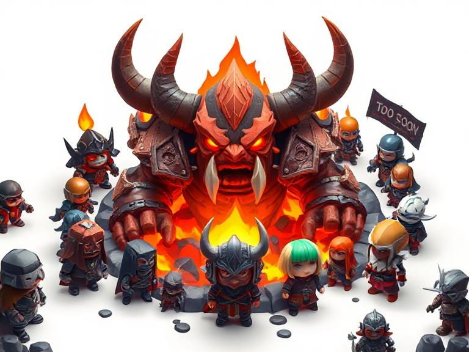

# 🎮 WoW Emulation Community Discussions

Community discussions for World of Warcraft emulation projects.

## 🌟 Purpose

This community focuses on preserving World of Warcraft versions 1.x through 5.x
(MPQ-based versions). The project aims to maintain these versions for research,
education, and preservation purposes.

Founded in August 2023.

Join our [Discord](https://discord.gg/Jj4uWy3DGP)!

## 💬 What Are These Discussions For?

This is your space to:

- 🤔 **Ask Questions** - Technical questions about server setup, packet analysis,
  and emulation
- 💡 **Share Ideas** - Feature proposals and technical approaches
- 🎯 **Report Issues** - Bug reports and technical problems
- 📚 **Learn Together** - Tutorials, guides, and documentation
- 🎉 **Share Progress** - Project milestones and achievements
- 🤝 **Connect** - Collaboration and networking

## 🌈 Community Values

- **🫂 Respectful Communication** - Maintain professional and patient interactions
- **🎓 Beginner-Friendly** - Support new contributors and learners
- **🔧 Open Source** - Share knowledge and collaborate openly
- **⏰ Weekend Activity** - Team members are most active on weekends

## 📋 Quick Guidelines

Discussion guidelines:

1. **Search First** 🔍 - Check existing discussions before posting
2. **Be Descriptive** 📝 - Include relevant technical details
3. **Stay On Topic** 🎯 - Keep discussions related to WoW emulation
4. **Follow Standards** 💖 - Adhere to the [Code of Conduct](https://github.com/wowemulation-dev/.github/blob/main/CODE_OF_CONDUCT.md)
5. **Contribute** 🎮 - Share knowledge and help others

## 🚀 Getting Started

New contributors should:

- **Introduce Yourself** - Post in the Introductions category
- **Check the FAQ** - Review common questions and answers
- **Browse Existing Discussions** - Learn from ongoing conversations
- **Ask Questions** - Post technical questions in appropriate categories

## 🤝 Other Ways to Connect

- **📧 Email**: <hello+github@wowemulation.dev>
- **🦣 Mastodon**: Follow us for updates and community highlights
- **📚 Documentation**: Check out our projects for detailed guides

## 🛡️ Important Links

- [Code of Conduct](https://github.com/wowemulation-dev/.github/blob/main/CODE_OF_CONDUCT.md)
- [Contributing Guidelines](https://github.com/wowemulation-dev/.github/blob/main/CONTRIBUTING.md)
- [Security Policy](https://github.com/wowemulation-dev/.github/blob/main/SECURITY.md)
- [Support Resources](https://github.com/wowemulation-dev/.github/blob/main/SUPPORT.md)

---

This community exists to preserve World of Warcraft's technical history through
emulation. Contributors of all skill levels can participate in development,
testing, and documentation efforts.

*Note: Community maintainer @danielsreichenbach and team members are most active
on weekends. Response times may vary during weekdays.*
